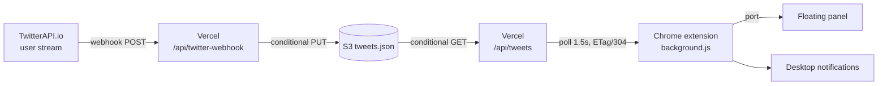

# 𝕏 Monitor — Real-Time X Monitoring

Breaking-news feed from Indian financial media and analysts on X, in a floating
Chrome panel with desktop notifications. **Active 9:00 AM – 3:30 PM IST every
day; completely idle otherwise. Nothing runs on your computer.**

---

## Architecture



Everything lives in Vercel + one S3 object. TwitterAPI.io pushes tweets to the
webhook; the webhook merges them into S3; the extension polls `/api/tweets`.
No laptop has to be awake.

### When things run

| Component | 9:00 – 15:30 IST | 15:30 – 15:35 | otherwise |
|---|---|---|---|
| TwitterAPI.io user stream | delivering | delivering | delivering (no off switch — see below) |
| Webhook stores tweets | yes | yes (grace) | no — fast `200`, nothing stored |
| Extension polling | every 1.5 s | only if **ON** was pressed | **zero requests** |
| Vercel function | per poll (mostly `304`) + per webhook batch | only if **ON** | not invoked |
| Store retention | today's posts (since 08:55) | today's posts | wiped at 08:55 next morning |

### Modes

- **Auto** (default) — polls only inside the market window. Nothing runs
  outside it: no timers, no fetches.
- **ON** — a 5-minute manual override that polls immediately, then returns to
  Auto by itself. Pressing ON again restarts the 5 minutes. Outside market
  hours nothing is being stored, so ON shows today's posts from the store;
  new ones arrive only 9:00–15:35.

There is no OFF. The worker survives Chrome killing the service worker: the
ON deadline is persisted, and `chrome.alarms` wake it at the exact next
8:55 / 9:00 / 15:30 / ON-expiry.

### Retention — wiped daily at 08:55 AM IST

Posts stay visible all day and overnight, then everything from before
**08:55 IST today** disappears at once, five minutes before the market opens.
The boundary is *computed* (`retentionCutoff()` in `src/lib/marketHours.js`,
mirrored in the extension), not a cron, so every layer agrees to the second:
the webhook drops old rows on write, `/api/tweets` hides them on read, the
extension filters on receive and purges its cache on an exact 08:55 alarm.
`/api/tweets` returns the newest 50 — the panel only ever shows 5.

### About overnight deliveries

TwitterAPI.io's user stream (`x_user_stream`) only supports add / remove /
list — there is no pause. Overnight, the webhook still receives posts and
answers `200` in a millisecond without touching S3, so the Vercel cost is
effectively zero. The TwitterAPI.io side is a flat "streamer" plan billed per
monitored account, not per delivered post, so overnight deliveries cost
nothing either. Deleting and re-adding monitors around market hours was
deliberately not automated — it would save nothing and monitors show a
provisioning state after being added, which risks missing the open.

### Why the webhook writes are safe

S3 has no "append". Two webhook deliveries arriving together would each read
the object, add their tweets, and the second write would erase the first. The
store does a **conditional PUT** (`If-Match: <etag>`): if anyone wrote in
between, S3 answers 412, and we re-read and retry. Nothing is ever lost.

---

## Set up (one time)

### 1. Secret

```bash
openssl rand -hex 24   # → WEBHOOK_SECRET
```

### 2. Vercel environment variables

```
USE_S3=true
AWS_REGION=…  AWS_ACCESS_KEY_ID=…  AWS_SECRET_ACCESS_KEY=…
AWS_S3_BUCKET_NAME=…  AWS_S3_KEY=tweets.json
WEBHOOK_SECRET=…               # from step 1
```

Deploy: `vercel --prod`.

### 3. TwitterAPI.io dashboard

Set the webhook URL to:

```
https://x-monitoring-dashboard.vercel.app/api/twitter-webhook?key=<WEBHOOK_SECRET>
```

Which accounts stream in is controlled by the **monitored users** list there
(User Stream → add user), not by anything in this repo. `GET
/oapi/x_user_stream/get_user_to_monitor_tweet` with your `X-API-Key` lists
them.

### 4. Extension

`chrome://extensions/` → Developer mode → **Load unpacked** → `extension/`.
After editing any extension file, click the reload arrow on its card.

---

## Operating it

**Backend health:** `GET /api/twitter-webhook` — shows the store backend
(`s3`), today's retention cutoff and market status.

**Extension:** `chrome://extensions/` → X Monitor → **service worker** → Console:

```
[X-Monitor BG] Service worker started
[X-Monitor BG] State loaded: mode=auto, 3 cached tweets, 41 seen IDs
[X-Monitor BG] Polling started (auto, 1500ms)
[X-Monitor BG] Backend reachable at https://x-monitoring-dashboard.vercel.app/api/tweets
[X-Monitor BG] +1 new — @NDTVProfit: "…"
```

Outside the window you should see `Polling stopped — backend idle` and then
nothing at all. Useful console commands:

```js
chrome.runtime.sendMessage({ type: 'GET_STATUS' }, console.log);
chrome.runtime.sendMessage({ type: 'SET_MODE', mode: 'on' });
chrome.runtime.sendMessage({ type: 'CLEAR_HISTORY' });
chrome.runtime.sendMessage({ type: 'TEST_NOTIFICATION' });
```

**Local dev:** `npm run dev`. With the AWS vars in `.env.local` it uses the
live S3 store; without `USE_S3` it uses `.data/tweets.json`. To test the
webhook locally:

```bash
curl -X POST "http://localhost:3000/api/twitter-webhook?key=$WEBHOOK_SECRET" \
  -H 'content-type: application/json' \
  -d '{"tweets":[{"id":"1","text":"test","created_at":"2026-09-21T05:00:00Z","author":{"username":"ANI","name":"ANI"}}]}'
```

---

## API

`GET /api/tweets` — the feed. Inside market hours (or with `?force=1`) it
returns `{ tweets, count, feedHash }` (newest 50) with an `ETag`; send it back
as `If-None-Match` to get a zero-byte `304`. Outside market hours without
`force` it returns a small, CDN-cached (`s-maxage=300`) empty response so the
function is not invoked for stray clients. The extension always sends
`?force=1` because it is itself the gate, and the query string keeps a cached
"closed" answer from 08:59 from being served back at 09:00.

`POST /api/twitter-webhook?key=…` — ingestion. Stores 9:00–15:35 IST only.

---

## Monitored accounts

The extension carries display metadata (`MONITORED_ACCOUNTS` in
`extension/panel.js`, `ACCOUNT_META` in `extension/background.js`) for 19
accounts — these are labels and colours only. **What actually streams in is
the monitored-user list on the TwitterAPI.io streamer plan** (billed per
account; currently a 5-account plan). As of 2026-09-20 the API lists six:
@moneycontrolcom, @NDTVProfit, @LiveLawIndia, @yatinmota, @darshanvmehta1,
@soumeet_sarkar. Changing the set is a dashboard/plan action; nothing in this
repo needs to change.

---

## Files

```
extension/background.js          service worker — scheduler, polling, retention, notifications
extension/panel.html/js/css      the floating panel (pure view)
extension/content.js             keep-alive port so Chrome doesn't kill the worker mid-session
extension/manifest.json          MV3 manifest

src/lib/store.mjs                S3 store: conditional GET reads, conditional PUT writes
src/lib/marketHours.js           the 9:00–15:30 IST window + 08:55 retention cutoff
src/lib/normalize.mjs            TwitterAPI.io payload → one tweet shape
src/app/api/tweets/route.js      feed endpoint (newest 50, ETag/304, off-hours edge cache)
src/app/api/twitter-webhook/     ingestion (webhook) + health
```
