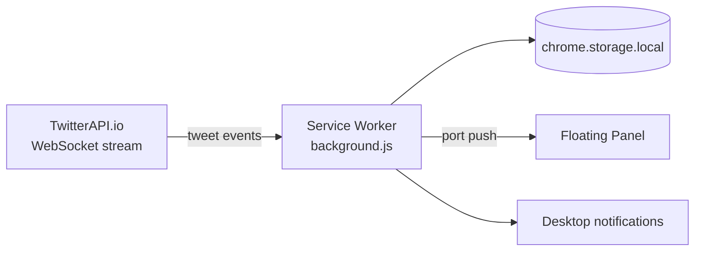

# 𝕏 Monitor — Real-Time X Monitoring

Breaking-news feed from Indian financial media and analysts on X, in a floating
Chrome panel with desktop notifications.

**Load the extension and it runs.** No server, no build, no ports, no startup
commands. The service worker holds the TwitterAPI.io stream itself.

---

## Install

1. `chrome://extensions/` → enable **Developer mode**
2. **Load unpacked** → select the `extension/` folder
3. Click the toolbar icon

That's it. There is no step 4.

---

## Architecture



Everything lives inside Chrome. The worker connects to
`wss://ws.twitterapi.io/twitter/tweet/websocket`, normalizes each tweet,
dedupes by ID, stores the last 300 in `chrome.storage.local`, and pushes to the
panel over a named port.

### The one trick

TwitterAPI.io authenticates by `x-api-key` **header only** — no query-string
tokens. Browser `WebSocket` cannot set request headers. So the worker installs a
dynamic `declarativeNetRequest` rule that injects the header into the WebSocket
handshake. Same mechanism the NSE/BSE watcher uses for BSE's `Referer` check.

---

## Configuration

`extension/config.js` — the only file you edit:

```js
const XMONITOR_CONFIG = {
  apiKey: '...',   // your TwitterAPI.io key
  wsUrl: 'wss://ws.twitterapi.io/twitter/tweet/websocket',
  maxHistory: 300,
};
```

It is gitignored. **If you ever zip this folder to share it, remove the key
first** — anyone with it can spend your credits.

Which accounts stream in is controlled by your **filter rule in the
TwitterAPI.io dashboard**, not by anything in this repo. The worker receives
whatever matches.

---

## What happened to the server

Earlier builds ran a Next.js backend on Render (later on localhost) that held
the WebSocket and exposed `/api/tweets` for the extension to poll. That is gone.

It cost money to host and, once local, produced a long tail of failure modes
that were invisible from the panel — a stale compiled build serving old data, a
zombie process holding port 3000, cached tweets rendered as if live. None of
those can exist now: there is no build, no port and no second process.

The Next.js app still sits in `src/`. Nothing uses it. Delete it when you're
ready, along with `scripts/`, `.data/` and the `@aws-sdk/client-s3`,
`mongoose`, `next`, `react` and `ws` dependencies.

Pre-migration originals are in `.backup/`.

---

## Operating it

**Is it connected?** `chrome://extensions/` → **service worker** → Console:

```
[X-Monitor] Booting (worker start) — zero-backend build
[X-Monitor] Auth header rule installed
[X-Monitor] ✅ Stream connected
[X-Monitor] Handshake confirmed (user 486045912732467200)
[X-Monitor] +1 tweet(s) — @NDTVProfit: "..."
```

The panel footer shows `Stream disconnected — reconnecting…` whenever the
socket is down. Reconnection is automatic with exponential backoff (1s → 30s).

**Force a reconnect** from that console:

```js
chrome.runtime.sendMessage({ type: 'RECONNECT' });
chrome.runtime.sendMessage({ type: 'CLEAR_HISTORY' });
chrome.runtime.sendMessage({ type: 'GET_STATUS' }, console.log);
```

**Coverage:** tweets are captured only while Chrome is running, and the stream
does not backfill — anything posted while Chrome was closed is missed. That was
true of the local-server build too.

**After editing any extension file**, click the reload arrow on the extension
card. Chrome never hot-reloads unpacked extensions.

---

## Monitored accounts

Display metadata lives in `src/lib/accounts.js` (used for panel colors/labels);
author resolution is in `background.js`.

**Financial media** — NDTV Profit, CNBC-TV18, ET NOW, Zee Business,
Moneycontrol, Livemint, Business Standard, Bloomberg
**News wires** — ANI, PTI, Live Law
**Journalists & analysts** — Yatin Mota, Darshan Mehta, Soumeet Sarkar,
Sharad Dubey, Lakshman Roy, Tarun Shukla

---

## Files

```
extension/background.js   service worker — stream, normalize, store, notify
extension/config.js       your API key (gitignored)
extension/panel.html/js   the floating panel
extension/content.js      keep-alive port for the worker
extension/manifest.json   MV3 manifest
```
